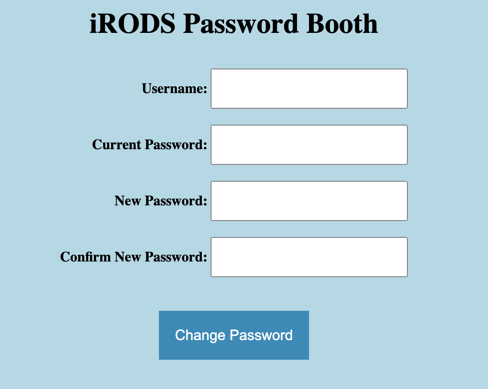

# iRODS Password Booth

The iRODS Password Booth is a *very small* web application with one job - to allow visitors to change their native iRODS password.

This <a href="https://cherrypy.dev/">CherryPy</a> application uses the Python iRODS Client to connect to iRODS and execute `modify_password`.



## Configuration

```
cp app.config.template app.config
vi app.config
```

The `[password_booth]` section requires updates to point to your iRODS Zone:
```
[password_booth]
#irods_host = 'host.docker.internal'
irods_host = 'irods.example.org'
irods_zone = 'tempZone'
irods_port = 1247
```

iRODS TLS/SSL settings are in the same section.

Other configuration settings can affect the layout:

```
#title = 'iRODS Password Booth'
#custom_html_header = ''
#custom_html_footer = ''
```

The CSS can be changed by editing `app.css`.

## Building and Running with Docker Compose

Docker Compose has been configured to volume mount the local `app.config` and `app.css`.

```
docker compose up
```

Connecting to `http://localhost:8000` (by default) will open the iRODS Password Booth.
